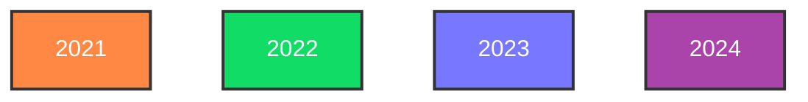
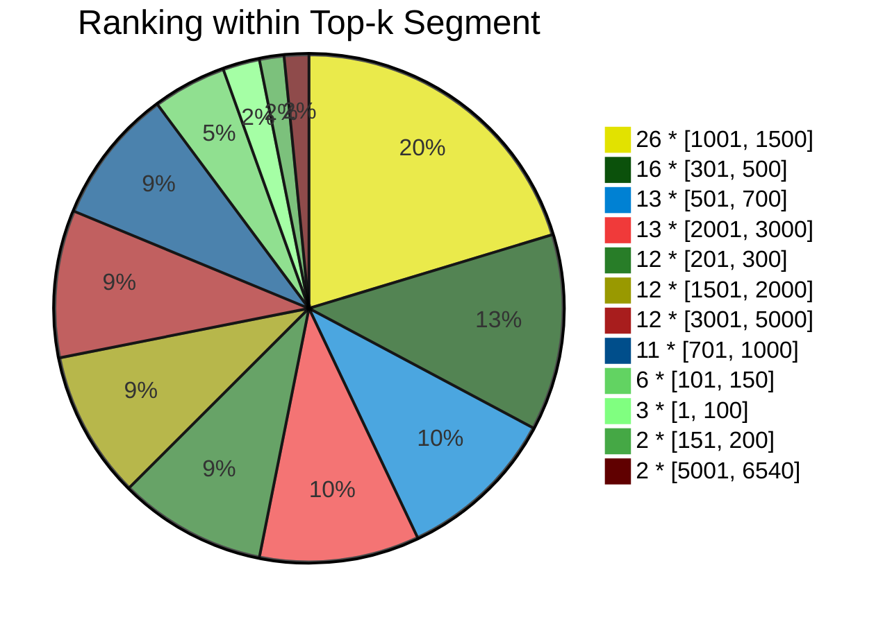

This is the home of my personal times, ranks and scores on [Advent of Code](https://adventofcode.com/).

Note that only those dates are included on which I participated in a *"competitive"* manner (i.e., being available at 6am CET and having a decent IDE).

In case you wonder, I use Python for competing starting from 2022 (solutions [here](https://github.com/phoyh/aoc-py)). Before it was JavaScript (solutions [here](https://github.com/phoyh/aoc-js)).

# Series Table
Rank by Quantile
```
Year | Best |  5% | 10% | 20% |  30% | Median |  75% |  90% | Worst
===================================================================
2021 |  128 | 137 | 142 | 351 |  544 |   1088 | 2110 | 2864 |  3617
2022 |   73 | 141 | 431 | 495 | 1042 |   1323 | 2177 | 4454 |  6540
2023 |   45 | 226 | 230 | 340 |  473 |    765 | 1655 | 2563 |  3932
2024 |  123 | 123 | 147 | 230 |  238 |    343 |  626 | 1347 |  1613
```
Frequency by Rank
```
Year | 100 | 150 | 200 | 300 | 500 | 700 | 1000 | 1500 | 2000 | 3000 | 5000
===========================================================================
2021 |  0% | 10% | 13% | 16% | 26% | 36% |  40% |  66% |  73% |  90% | 100%
2022 |  3% |  6% |  9% |  9% | 21% | 21% |  25% |  53% |  71% |  81% |  93%
2023 |  4% |  4% |  4% | 16% | 32% | 44% |  58% |  74% |  80% |  90% | 100%
2024 |  0% | 12% | 12% | 43% | 50% | 75% |  87% |  93% | 100% | 100% | 100%
```

# Series Chart




# Overall

